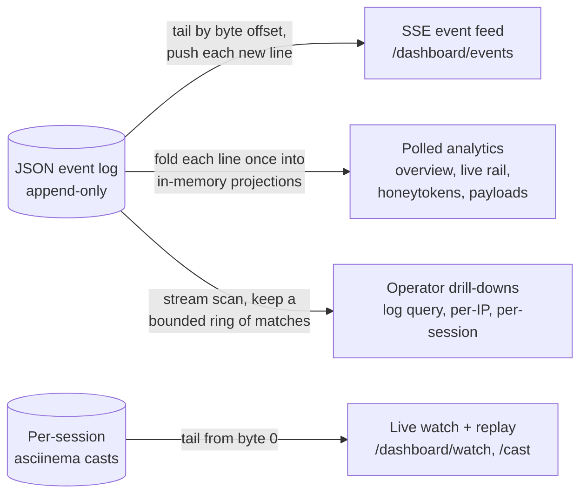
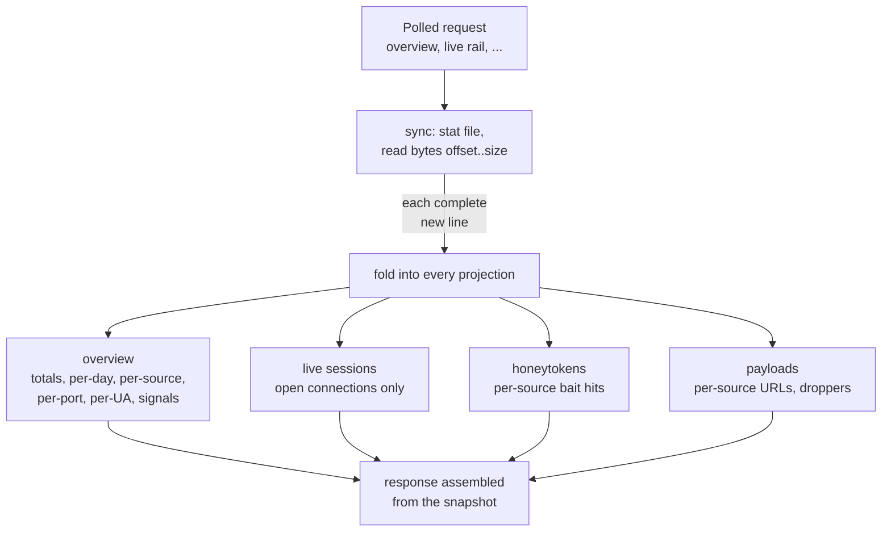

# SweeTTY: Portal Architecture

The management portal is the honeypot's read side: a single-page dashboard over the structured event log and the per-session cast recordings, served from the same binary as the listeners. It stores nothing of its own. Every view is derived, on demand, from two operator-owned artifacts the sensor already writes, so the portal can be restarted, upgraded, or rebuilt at any time without losing a byte of evidence. [`ARCHITECTURE.md`](./ARCHITECTURE.md) places the portal in the whole system; this covers how the portal itself works.

## First principles

- **The log is the single source of truth.** The listeners append one sanitized JSON object per event to a single file. Every portal view (analytics, live rail, drill-downs, the streaming feed) is a fold or a tail over that file. There is no database, no write path from the portal, and no state that can disagree with the log.
- **Loopback only, SSH is the front door.** The portal binds `127.0.0.1` and serves plain HTTP with no application auth. The operator reaches it by port-forwarding the box's real management SSH (itself on a randomized port). Key auth is the single gate; the portal adds no second credential to steal or leak.
- **Nothing off-host.** The dashboard is one embedded HTML page with inline CSS and JS, no framework, no CDN, no external font or image. Everything it fetches comes from the same loopback origin. An operator watching an active intrusion generates no third-party traffic that could tip the attacker or leak telemetry.
- **Reading is passive.** The portal only observes. Watching a live session tails the session's cast file; it offers no path to inject input, so the operator can never cross into the deception surface. The one write-shaped feature, the admin console proxy, forwards only to operator-configured local targets and never to a request-supplied host.
- **Attacker bytes are hostile everywhere.** Fields are sanitized at write time (the event package strips control bytes and newline injection), the dashboard renders text through DOM text nodes rather than HTML, and terminal frames are stripped of escape sequences before display.

## Three access patterns

Every route falls into one of three shapes, each matched to how often it runs and how much it may cost:

- **Streamed** routes push new data as it lands and never re-read history.
- **Polled** routes answer the dashboard's refresh loops (the live rail polls roughly every 700ms) and therefore must never cost a full log read; they read incrementally maintained projections.
- **Drill-downs** are operator-initiated one-offs (open a source drawer, inspect a session), so a single streaming pass over the file is acceptable; what is bounded is memory, not I/O.

## The event feed (SSE)

`/dashboard/events` streams new log lines over Server-Sent Events. The design leans entirely on the log being append-only:

- **The event id is a byte offset.** Each pushed line carries `id: <offset just past it>`. The feed holds an open file handle and polls for complete new lines every 500ms, buffering a partially written line until its newline lands.
- **Reconnects resume exactly.** On an automatic browser reconnect, `Last-Event-ID` replays the last offset; the feed seeks there and backfills everything written during the gap. Nothing is lost and nothing is duplicated, with no server-side subscriber state.
- **A fresh connection starts at the end.** History is the projections' job; the feed only streams what happens next. A stale offset (past a rotated file's size) degrades to end-of-file rather than erroring.
- **Idle streams stay alive.** A comment ping goes out after ~10s of silence so proxies and the browser keep the connection open.
- **Subscribers are gated.** Each stream holds a goroutine and a file descriptor for its whole life, so concurrent subscribers are capped (64) and the excess is shed with a 503 rather than served into exhaustion.

The dashboard uses the feed both to append the visible event stream and as a trigger: an event naming a session updates the live rail optimistically, and a notable event (a honeytoken trip, a payload pull) refreshes the stat cards immediately while routine volume rides the slow timer.

## Live watch and replay

Recorded sessions are asciinema v2 cast files, one per connection, written by the server's recording tap: output events carry the bytes the attacker saw, input events (`"i"`) carry what they typed, so a bot that blasts credentials into a silent prompt is still visible. Two routes read them:

- **Replay** (`/dashboard/cast/{id}`) serves the finished file; the browser plays it back with capped inter-frame gaps.
- **Live watch** (`/dashboard/watch/{id}`) streams a cast still being written, over the same SSE mechanics as the event feed: start at byte 0 so a watcher joining mid-session sees everything so far, then follow new frames as the honeypot writes them. Watchers are gated (32) like feed subscribers.

Watching is strictly read-only. The stream carries frames out; no route carries input back, so the operator can observe an active session without ever acting inside it.

## Incremental projections

The polled analytics used to re-read and re-parse the whole log on every request. On a busy sensor that is hundreds of megabytes of transient allocation per dashboard load, multiplied by concurrent panels and refresh loops; on a small instance it is enough to take the process past its memory and get it killed just by opening the console. The projections replace that with a fold that costs each log line exactly once.

The mechanics, all in `internal/portal/store.go`:

- **Sync on request, by byte offset.** A projection-backed handler first folds the log's unread tail (usually a few kilobytes) under one store mutex, then assembles its response from the in-memory state. There is no background goroutine and no cache invalidation problem: the projections are exactly as fresh as the log at request time.
- **The fold is streaming.** Lines are read and folded one at a time; even the first fold after a restart (the whole file) never materializes the log in memory.
- **Rotation resets.** A file smaller than the folded offset means rotation or truncation; the store drops every projection and refolds from the start.
- **A partial line folds once.** A line whose newline has not landed yet is left for the next sync, so a mid-write read can neither drop nor double-count it.
- **Equivalence is the contract.** Folding incrementally with reads in between produces byte-identical responses to a fresh process folding the finished log in one pass. A test pins exactly that property, alongside rotation, partial-line, and eviction tests (`internal/portal/store_test.go`).
- **The live projection holds only open sessions.** A `SESSION_END` deletes its entry immediately and idle orphans (a hard restart loses its END) are swept past double the rail's visibility window, so the projection cannot accumulate every session id the log has ever seen.
- **Verdicts share one fold.** The per-source bot/human classifier (`internal/portal/analyze.go`) folds events through the same `observe` used by the per-IP drawer, so the tag on the sources list and the verdict in the drawer can never disagree.

## Drill-downs: bounded streaming scans

The log query, per-IP, and per-session routes answer questions whose filters are unknown until asked, so they scan the file rather than hold projections. The scan streams line by line and keeps only what the response needs:

- **The feed query** keeps a ring of the newest `limit` matches (capped at 1000), returned newest first.
- **Per-IP and per-session transcripts** keep the newest 5000 matching entries and say so (`"capped": true`) when older ones were dropped.
- **The per-IP assessment reads everything.** The verdict analyzer folds over the source's complete history as the scan streams past, so a capped transcript never changes a classification: what the operator reads may be trimmed, what the classifier judged is not.

## The live rail

The dashboard's "sessions in progress" rail combines the two freshness mechanisms. The active-sessions endpoint (projection-backed) is the reconciling truth, polled on a short timer; SSE events edit the rail optimistically in between, so a new connection appears the moment its `SESSION_START` streams past rather than a poll later. Sessions with a cast on disk offer watch and replay.

## Admin console proxy

`/dashboard/console/{name}` reverse-proxies operator-configured local consoles (the HAProxy stats page) through the same tunnel origin. Targets come only from the instance config, must parse to a loopback or private address, and cookies and authorization headers are stripped before forwarding. A misconfigured target is skipped with a logged warning; the proxy can never be steered by a request to reach an arbitrary host, so it stays a local convenience and never an egress path.

## Bounds and failure tolerance

Every unbounded input has a cap, and every failure degrades to an empty or smaller answer rather than an error page:

| Concern | Bound |
|---|---|
| SSE subscribers / live watchers | 64 / 32, excess shed with 503 |
| Feed query size | 200 default, 1000 max |
| Overview per-source rollup | busiest 300 (headline counts stay exact) |
| Top user agents | 50 |
| Drill-down transcripts | newest 5000, flagged when capped |
| Scanner line length | 4 MB, longer lines skipped |
| Malformed log lines | skipped, never abort a read |
| Handler panics | recovered to a 500, portal stays up |

## Memory model

Measured at production scale (roughly 100k events, 1.9k sources, 21k sessions):

- The projections hold about **9 MB** of live heap. Their growth tracks distinct sources and open sessions, not request traffic and not (for the live rail) total history.
- The geo and ASN databases dominate the baseline at roughly **65 MB** for typical public datasets (~900k ranges). They are loaded whole into the portal plane deliberately: the honeypot plane never performs a lookup, and the resolver answers from memory with no I/O on any request path.
- Process RSS sits near twice the live heap under Go's default GC headroom, flat under concurrent dashboard load. The pathological mode this design removes is multiplication: request concurrency no longer multiplies parse cost, because there is nothing left to parse per request but the log's unread tail.
